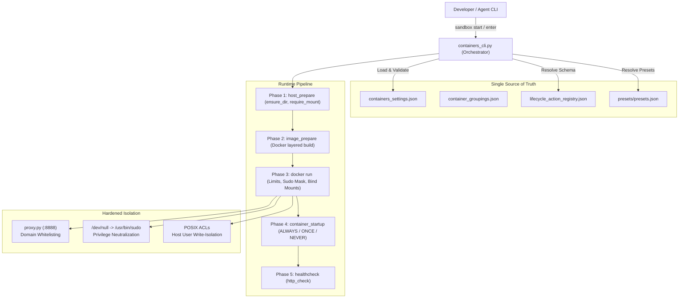

# 🛡️ Docker Sandbox Protocol

[](https://www.docker.com/)
[](https://www.python.org/)
[](LICENSE)
[](https://kernel.org)

**Docker Sandbox Protocol** is an enterprise-grade, reproducible container orchestration framework designed for autonomous AI agents, untrusted code execution, and segmented developer sandboxes on Linux.

It enforces **gated autonomy**: enabling agents to develop software, run tests, and spin up services within isolated environments while mechanically preventing host configuration tampering, unauthorized privilege escalation, and unintended network egress.

---

## 📐 Architecture



---

## ✨ Key Features

- **🛡️ Gated Privilege Neutralization:** Completely neutralize `sudo` inside containers without rebuilding images by mount-masking `/dev/null` over `/usr/bin/sudo` when `security.allow_sudo` is `false`.
- **🌐 Granular Egress Filtering Proxy:** Python socket proxy (`config/proxy.py`) intercepts outbound HTTP and HTTPS `CONNECT` tunnels, enforcing wildcard domain whitelists (e.g. `*.github.com`, `pypi.org`) and blocking unauthorized egress with `403 Forbidden`.
- **⚙️ Declarative Lifecycle Action Pipeline:** Validates action schemas against `lifecycle_action_registry.json` across 5 phases: `host_prepare`, `image_prepare`, `container_startup`, `healthcheck`, and `shutdown`.
- **📦 Semver Presets Dependency Engine:** Declare requirements like `llama-server ~1.0` or `nodejs >= 18` directly in JSON; the orchestrator resolves versions and layers custom Docker images on the fly.
- **🧩 Docker Compose Delegation:** Seamlessly orchestrates native `docker-compose.yml` stacks (e.g., Nextcloud, databases, microservices) alongside unprivileged developer sandboxes.
- **🔐 Ordered Compose Environment Files:** Compose targets can load credential and runtime wrapper files only for the Compose subprocess through `compose_env_files`, without persisting credential values in the active inventory.
- **🏷️ Logical Groupings & Bulk Orchestration:** Target individual containers, defined groups (`sandbox start g development`), or all sandboxes at once (`sandbox start *`).
- **💻 Portable & Machine-Agnostic:** Designed with dynamic path resolution and sample configurations (`*.example.json`) ready to clone and run on any Linux distribution.

---

## 🚀 Quick Start

### 1. Prerequisites
- **Linux** (Ubuntu 20.04/22.04/24.04, Debian, Fedora, Arch, etc.)
- **Docker Engine** through a rootless context (preferred) or another explicitly authorized context
- **Python 3.9+**

### 2. Clone & Install
```bash
# Clone the repository
git clone https://github.com/your-username/docker-sandbox-protocol.git
cd docker-sandbox-protocol

# Run the automated installer
./install.sh
```

The installer will:
1. Verify Docker and Python 3 prerequisites.
2. Initialize active config files (`*.json`) from example templates (`*.example.json`).
3. Prepare `~/sandbox/workspace` and `~/sandbox/scratch` directories.
4. Symlink the `sandbox` command to `/usr/local/bin/sandbox`.
5. Build the base `agent-sandbox` Docker image.

### 3. Verify Installation
```bash
sandbox status
```

---

## 🛠️ CLI Command Reference

The unified `sandbox` CLI manages all containers and groups:

| Command | Usage | Description |
| :--- | :--- | :--- |
| `status` | `sandbox status` | Displays the live multi-container dashboard with group names, network states, sudo status, and resource limits. |
| `start` | `sandbox start [target]` | Executes lifecycle hooks and boots matched container(s). |
| `stop` | `sandbox stop [target]` | Runs shutdown hooks, stops, and removes matched container(s). |
| `rebuild` | `sandbox rebuild [target]` | Rebuilds Docker images from presets and restarts container(s). |
| `enter` | `sandbox enter [name]` | Opens an interactive bash shell session inside the target container. |
| `in c` | `sandbox in c <name> [<open\|run> <selector> [args...]]` | Lists or calls configured commands for one container. Use `.` for that operation's default. |
| `explain` | `sandbox explain [target]` | Validates schema and prints the resolved lifecycle action execution plan. |
| `logs` | `sandbox logs [target]` | Streams live stdout/stderr container logs in real time. |
| `edit` | `sandbox edit` | Opens `containers_settings.json` in your preferred editor (`$EDITOR` / VS Code). |

### Target Expressions
- **Single container:** `sandbox start dev-sandbox`
- **Wildcard (all containers):** `sandbox start \*`
- **Logical group:** `sandbox start g development`
- **Multiple groups:** `sandbox start g {development,ai}`
- **Comma-separated list:** `sandbox start {dev-sandbox,ai-service}`

---

## ⚙️ Configuration Guide

Configuration files are located in the [`config/`](config/) directory:

### 1. Container Definitions (`config/containers_settings.json`)
Defines container limits, volumes, network access, and lifecycle hooks:

```json
{
  "name": "dev-sandbox",
  "enabled": true,
  "cpu_limit": 4.0,
  "memory_limit": "8g",
  "workspace_path": "~/sandbox/workspace/dev",
  "scratch_path": "~/sandbox/scratch/dev",
  "network": {
    "host_access": {
      "enabled": true,
      "allowed_ports": [3000, 8080],
      "published_port_scope": "public"
    },
    "external_access": ["*"],
    "container_access": ["*"]
  },
  "security": {
    "allow_sudo": false,
    "run_as_user": "1001:1001",
    "cap_drop": ["ALL"],
    "no_new_privileges": true
  },
  "lifecycle": {
    "host_prepare": [
      {
        "@action": "ensure_dir",
        "path": "~/sandbox/workspace/dev"
      }
    ],
    "container_startup": {
      "behavior": "NEVER",
      "steps": [
        {
          "@action": "echo",
          "lines": ["Workspace ready."]
        }
      ]
    }
  }
}
```

`run_as_user` applies Docker's runtime user override. Use an identity that the
image supports and ensure its writable mounts have matching ownership.
`cap_drop` and `no_new_privileges` map to Docker's `--cap-drop` and
`--security-opt no-new-privileges=true` controls.

To pin the harness to a dedicated Docker context without changing the user's
global Docker context, set `SANDBOX_DOCKER_CONTEXT`:

```bash
SANDBOX_DOCKER_CONTEXT=sandbox-rootless sandbox status
```

The selected context is inherited by Docker commands launched from lifecycle
scripts. The context and its daemon must already exist; the harness does not
install or start Docker.

#### Configured container commands

Each container may expose named host targets through `open` and direct container
processes through `run`:

```json
"commands": {
  "open": {
    "default": {
      "target": "home",
      "args": [],
      "allow_user_args": false
    },
    "targets": {
      "home": {
        "type": "url",
        "value": "http://127.0.0.1:18080",
        "requires_running": true,
        "args": [],
        "allow_args": false
      }
    }
  },
  "run": {
    "default": {
      "function": "search",
      "args": ["--format", "json"],
      "allow_user_args": false
    },
    "functions": {
      "search": {
        "argv": ["python3", "/app/search.py"],
        "args": [],
        "allow_args": true
      }
    }
  }
}
```

```bash
sandbox in c searxng
sandbox in c searxng open .
sandbox in c searxng run .
sandbox in c searxng run search "query text"
```

Calling only the container name prints its available `open` and `run` selectors,
their default mappings, and whether they accept caller arguments. This catalog
does not require Docker access.

The `.` selector resolves the advanced `default` object. Its configured `args`
are appended automatically, while `allow_user_args: false` rejects extra caller
arguments. Named functions accept caller arguments only when their `allow_args`
value is true. `run` executes the configured `argv` directly through
`docker exec` without a shell. `open` accepts only configured HTTP(S) URLs or
existing host files and launches them with `xdg-open`.

### 2. Network Isolation Postures
Configure `network` in `containers_settings.json` to enforce isolation:

- **Full Access (`ON`):**
  `"external_access": ["*"], "container_access": ["*"]`
- **Domain Whitelisted (`PROXY`):**
  `"external_access": ["*.github.com", "pypi.org"]`
  Outbound requests are routed through the proxy; unauthorized domains are blocked with `403`.
- **Local Loopback Only (`LOCAL`):**
  `"published_port_scope": "loopback"`, `"external_access": []`
  Binds exposed ports strictly to `127.0.0.1` on the host. No internet egress.
- **Airgapped (`OFF`):**
  `"host_access": false`, `"external_access": []`

### 3. Container Groupings (`config/container_groupings.json`)
Maps containers to logical categories with optional naming prefixes or suffixes:

```json
{
  "container_groupings": {
    "development": {
      "containers": ["dev-sandbox", "restricted-agent"],
      "default_container": "dev-sandbox",
      "naming": {
        "prefix": "dev-",
        "suffix": ""
      }
    }
  }
}
```

---

## 🔄 Lifecycle Action Pipeline

Lifecycle actions are modular, parameterized scripts defined in `config/lifecycle_action_registry.json`:

| Action | Phase | Description |
| :--- | :--- | :--- |
| [`ensure_dir`](docs/LIFECYCLE_ACTIONS.md#1-ensure_dir) | `host_prepare`, `shutdown` | Ensures host directory exists with proper permissions. |
| [`require_mount`](docs/LIFECYCLE_ACTIONS.md#2-require_mount) | `host_prepare`, `healthcheck` | Verifies and validates active host mountpoints. |
| [`require_file`](docs/LIFECYCLE_ACTIONS.md#3-require_file) | `host_prepare`, `healthcheck` | Verifies file existence or creates placeholder. |
| [`http_check`](docs/LIFECYCLE_ACTIONS.md#4-http_check) | `healthcheck` | Probes HTTP status endpoints with retries. |
| [`install_preset`](docs/LIFECYCLE_ACTIONS.md#7-install_preset) | `image_prepare` | Dynamically injects software layers during build. |
| [`shell`](docs/LIFECYCLE_ACTIONS.md#5-shell) | Multiple | Executes arbitrary shell commands. |
| [`echo`](docs/LIFECYCLE_ACTIONS.md#6-echo) | Multiple | Logs formatted lifecycle output lines. |

For detailed parameters and JSON schemas, see the [Lifecycle Action Reference](docs/LIFECYCLE_ACTIONS.md).

---

## 🔒 Advanced Host Security (Optional)

For production host hardening where agents run directly under a designated host account:

1. **POSIX Access Control Lists (ACLs):**
   Compile kernel-level ACLs to grant read/write access to `~/sandbox` while blocking private configurations (`~/.ssh`, `~/.gnupg`):
   ```bash
   sudo ./tools/compile_policy.py
   ```
2. **Google Authenticator MFA Gate:**
   Configure PAM (`/etc/pam.d/sudo`) to enforce Google Authenticator OTP verification for any administrative action outside the pre-approved whitelist. See [docs/SPECIFICATION.md](docs/SPECIFICATION.md) for full instructions.

---

## 🐍 Python SDK Framework

Docker Sandbox Protocol provides an importable, typed Python SDK for direct programmatic orchestration:

```python
from docker_sandbox import Sandbox, SandboxConfig

# Initialize client (auto-discovers configuration and paths)
sandbox = Sandbox()

# 1. Inspect status across all container groups
report = sandbox.status()
if report.docker_available:
    for group_name, containers in report.groups.items():
        for c in containers:
            print(f"{c.name}: {c.raw_status} (Network: {c.network_mode})")

# 2. Start a container or grouping
results = sandbox.start("searxng")
for res in results:
    print(f"[{res.target}] {res.action}: success={res.success} ({res.message})")

# 3. Validate lifecycle execution plans
plans = sandbox.explain("bias-graph-feed")
plan = plans["bias-graph-feed"]
if plan.is_valid:
    print("Lifecycle plan is valid. Steps:", plan.phases)

# 4. Resolve configured command invocations
cmd = sandbox.in_cmd("searxng", operation="run", selector=".", user_args=[])
print(f"Command argv: {cmd.argv}")

# 5. Stop containers
sandbox.stop("searxng")
```

Installable directly in editable mode:
```bash
pip install -e .
```

An installed package deliberately does not guess which Sandbox instance it
should control. Bind it to the selected instance before calling the SDK or its
console command:

```bash
export SANDBOX_ROOT=/path/to/docker-sandbox-protocol
export SANDBOX_CONFIG_DIR="$SANDBOX_ROOT/config"
sandbox status
```

Programmatic consumers should pass the same location explicitly. The SDK never
discovers a `sandbox` executable from `PATH`.

---

## 📂 Repository Layout

```txt
docker-sandbox-protocol/
├── bin/
│   └── sandbox                          # Command-line launcher wrapper
├── src/
│   └── docker_sandbox/                  # Python SDK framework package
│       ├── __init__.py                  # Public exports (Sandbox, models, exceptions)
│       ├── client.py                    # Core Sandbox orchestration client
│       ├── config.py                    # Path resolution and JSON loaders
│       ├── exceptions.py                # Structured exception classes
│       ├── lifecycle.py                 # Multi-phase lifecycle schema validator
│       ├── models.py                    # Typed result dataclasses (StatusReport, etc.)
│       └── cli.py                       # Formatted terminal UI and command handlers
├── config/
│   ├── Dockerfile                       # Base unprivileged agent container image
│   ├── containers_cli.py                # Backward-compatibility CLI adapter
│   ├── proxy.py                         # Egress filtering HTTP/CONNECT socket proxy
│   ├── lifecycle_action_validator.py    # Backward-compatibility validator adapter
│   ├── lifecycle_action_registry.json   # Action schema specifications
│   ├── containers_settings.example.json # Sample container definitions
│   ├── container_groupings.example.json # Sample container grouping classifications
│   ├── agent_secrets_vault.example.json # Sample credentials vault template
│   └── containers_permissions.example.json # Sample POSIX ACL policy
├── pyproject.toml                       # Package build specification
├── tests/                               # Unit test suite
│   ├── test_containers_cli.py
│   └── test_sdk.py
├── docs/
│   ├── SPECIFICATION.md                 # Complete security & architecture specification
│   └── LIFECYCLE_ACTIONS.md             # Detailed guide to lifecycle action schemas
├── presets/
│   └── presets.json                     # Dynamic dependency package definitions
├── scripts/                             # Executable lifecycle action implementations
│   ├── echo.sh
│   ├── ensure_dir.sh
│   ├── http_check.sh
│   ├── install_preset.sh
│   ├── require_file.sh
│   ├── require_mount.sh
│   └── shell.sh
├── tools/                               # Kernel ACL policy compilation tools
│   ├── apply_sandbox_acls.sh
│   └── compile_policy.py
├── install.sh                           # One-step automated installer
├── .gitignore                           # Ignores live credentials and configurations
└── README.md                            # Project documentation
```

---

## 📄 License

This project is licensed under the [MIT License](LICENSE).
